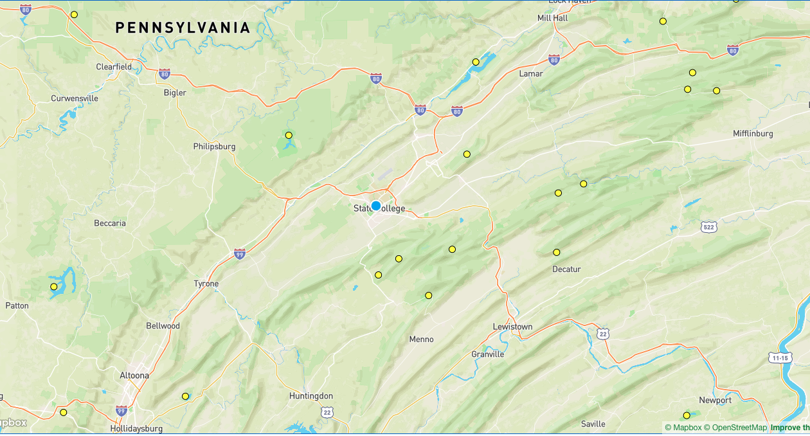

```{r setup, include=FALSE}
knitr::opts_chunk$set(echo = FALSE, fig.align = 'center')
```

## Parks on the Air (POTA)

- Parks on the Air (POTA): <https://parksontheair.com/>
- Portable operation in a national or state/provincial park
- Promote amateur radio & have fun

---

```{r, out.width="1000px"}

```

## Planning

- When
  - Sat late am/early pm in Sept (9/26), Oct (10/3, 17, 31), or Nov (11/11)
- How
  - SSB/data/CW, battery/solar or generator power, probably 20, 40m
- Where
- Who
